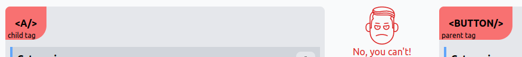
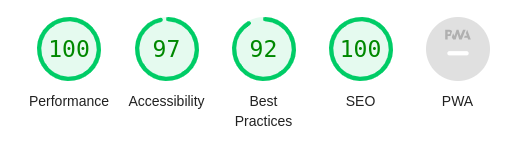
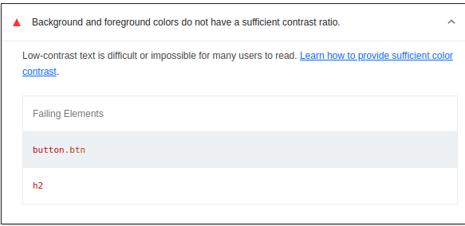

* lien de déploiment : 
Après avoir crée un fork du dépôt, on le clone en local:
[lien de deploiment](https://ounissasadaoui.github.io/Refont_design/)
# On repère et on Corrige les erreurs rencontrées:

## W3C validator
on voit qu'il y a a plusieurs erreurs, 9 pour être exacte

### le header est vide, 
-- il n'y a pas de link de description, ni de meta viewport, ou de charset, ==> on les ajoute donc, 
-- il n'y a pas de link manifest pour favicon, on n'a donc pas d'affichage d'icone ==> on met les liens manifest dans le head, en balise <link > ==> on passe aussi le manifest sur le site json formateur et processor: "https://jsonformatter.curiousconcept.com/#" pour avoir un bon manifeste
on y ajoute le attributs "name" et "link" et on ajoute les parties pour les icones de taille 16 et 32 
```json
       {
         "src":"android-chrome-32x32.png",
         "sizes":"32x32",
         "type":"image/png"
      },
```
et on met les bons chemins pour les src, comme suit:
```json
       {
         "src":"./android-chrome-32x32.png",
         "sizes":"32x32",
         "type":"image/png"
      },

```
###  Bad value for attribute name on element input: Must not be empty:

pour des questions d'accessibilité, on va nommer les elements < input>
on fait la même pour input password

### Stray end tag a:
il y a deux balises ouvrantes < a> pour une balise fermante, on supprime la seconde balise fermante.

### Stray end tag div
il y a une deux balises fermantes < /div> sans leur homologues fermantes

### The element button must not appear as a descendant of the a element
Quand on va sur le site canInclude, on voit bien qu'on ne peut pas utiliser la balise < a> à l'interieur d'une balise < button> comme suit:
.
c'était comme ça :
``` html
    <a href="#"> <button class="btn">Search</button></a>
```
on enlève  la balise englobante < a>, on laisse juste le button:
```html
    <button class="btn">Search</button>
```
on a le problème inverse ensuite, des a dans des button, et vu que la balise < a> sert à mettre des liens, on a juste à enlever les balises < a>, on laisse les button:

```html
   <button class="btnn">Login</button>
```

## Lighthouse dans chrome :

on va dans lighthouse pour inspecter , on trouve cela, après les modifications précédement appliquées :
.

-- dans accessiblité, il y a ce message d'erreur:
.

il y a donc un problème de contraste entre la couleur du boutton et celle du bg, me,chose entre la couleur de la font et le bg dans : login, search et le titre: developpement (partout ou il y ce orange), le orange sur le blanc ça ne v


### Autre:

--pour une question d'accessiblité , il faut tout englober dans une balise main.

--il y a une balise logo vide, ou j'ai mis mon nom
--je mets les alt pour les logos
--Il n'y a pas de balises label pour les input du formulaire
on pourrait bien les mettre, puis ajouter des id pour que l'attribut champ y fasse référence, sauf que pour des raisons de respect de la charte graphique, il vaut mieux utiliser le placeholder, 

### Problèmes d'accessibilité :

--on remarque qu'il y a plusieurs div dans le code, ce qui n'est pas optimal pour l'accessibilité, ou le landmark; on va essayer d'ameliorer ça:

* On met des balises form à la place des balises div pour les formulaires 
* il y a une div class= "main" on la remplace par la balise sémantique main, qui est le conteneur principal

j'ai changé l'image d'arrière plan

# La css
pour commencer, on ajoute un selecteur html dans lequel on met la font-size à 62.5%
on aoute ensuite un selecteur body , avec la propriété:   ``` font: 1.6rem sans-serif;``` 


on change ensuite tous les px en rem, sachant que 1 rem = 10px.


